# Printing Samples
Samples are available to create print layouts for each type of business. Please select a sample that closely resembles the layout you would like to print in your application and edit the sample code to make use of it.

- [Label Samples](#LabelSamples)
- [Receipt Samples](#ReceiptSamples)
- [Graphic Samples](#GraphicSamples)

> :warning: Some printer models may not be able to print some samples. Please confirm the APIs available for that model and adjust the layout accordingly when using this samples.

## Label Samples
There are some samples of generating labels using the template printing function.

Please combine LabelSampleXX_SampleName_Template.tsx as template and LabelSampleXX_SampleName_FieldData.json as field data.

For samples \#1 - \#2 and \#8 - \#18, we also provide source code that does not use the template printing function.

| \# | Sample Name | Printing Result Image | Printable Area       |
|----|-------------|-----------------------|----------------------|
| 1 | Tamper Proof Label |  | 72mm |
| 2 | Drink Label1 |  | 48mm |
| 3 | Drink Label2 |  | 48mm |
| 4 | Drink Label3 | 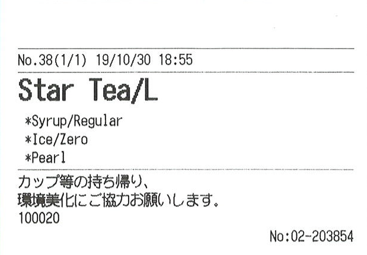 | 72mm |
| 5 | Drink Label4 |  | 72mm |
| 6 | Drink Label5 |  | 48mm |
| 7 | Drink Label6 | 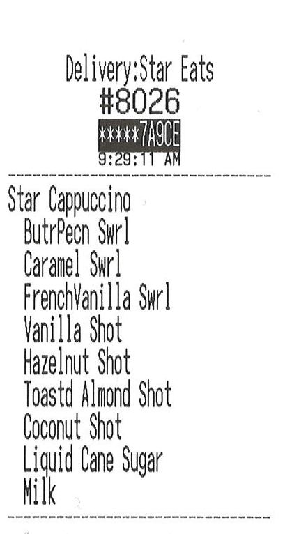 | 48mm |
| 8 | Nutrition Facts Label |  | 72mm |
| 9 | Food Prep Label | 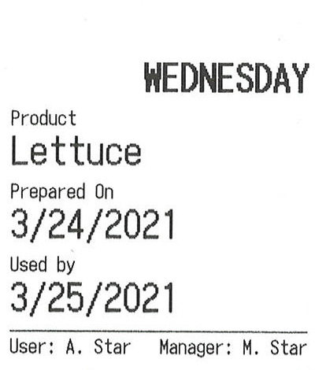 | 48mm |
| 10 | Food Delivery | 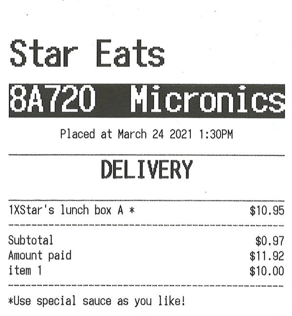 | 72mm |
| 11 | Shipping Address Label |  | 72mm |
| 12 | Inventory Label | 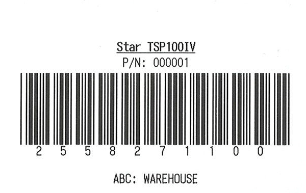 | 72mm |
| 13 | Food Product Label |  | 72mm |
| 14 | Expiration Label(JP) | 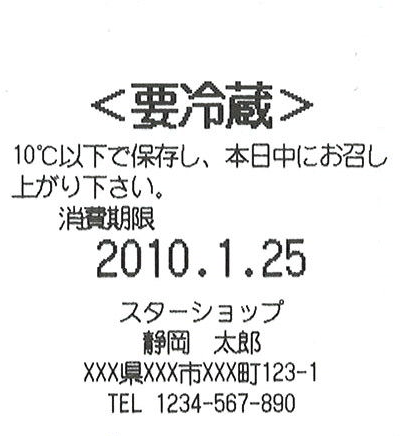 | 48mm |
| 15 | Food Delivery Label(Thai) |  | 48mm |
| 16 | Japanese Food Label(Lunch Box) |  | 48mm |
| 17 | Japanese Food Label(Cake) |  | 48mm |
| 18 | Shelf Label for Inventory | 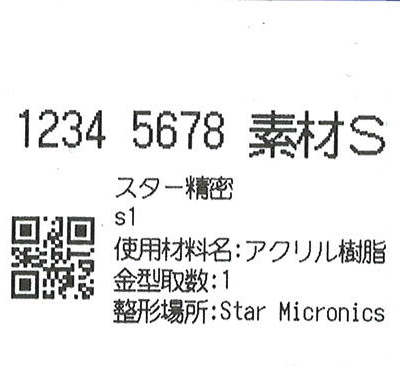 | 48mm |
| 19 | Pharmacy Medication1 |  | 72mm |
| 20 | Pharmacy Medication2 | 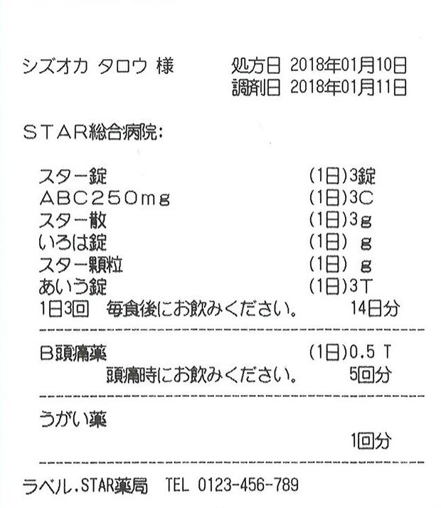 | 72mm |
| 21 | Shipping Label1 | 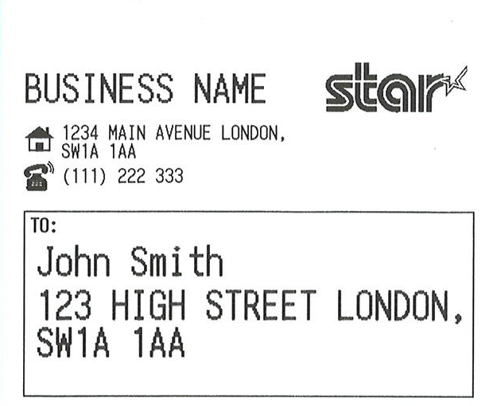 | 72mm |
| 22 | Shipping Label2 | 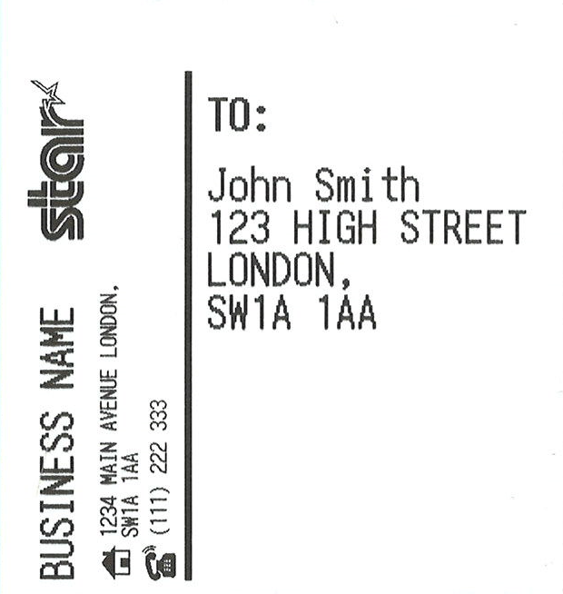 | 72mm |
| 23 | Barcode Label1 |  | 72mm |
| 24 | Barcode Label2 | 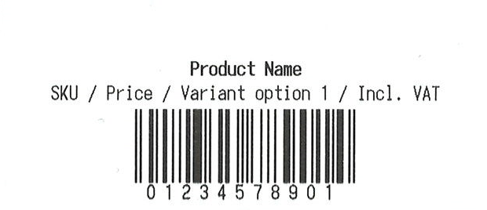 | 48mm / 72mm |
| 25 | Order Label | 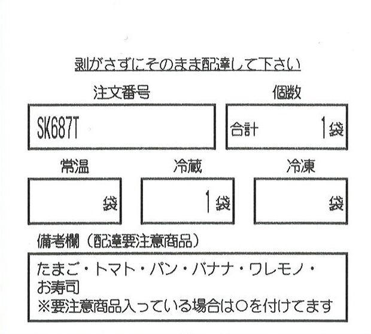 | 72mm |
| 26 | Prescription Label |  | 48mm |
| 27 | Allergen Warning | 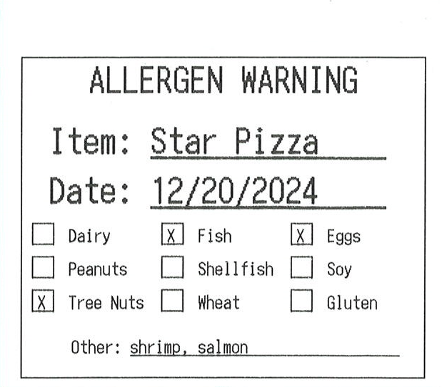 | 72mm |
| 28 | Cleaned And Sanitised |  | 72mm |
| 29 | Coffee Order |  | 72mm |
| 30 | Expiration Date | 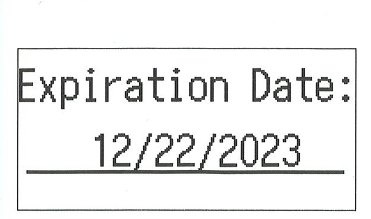 | 72mm |
| 31 | FoodSafety Info | 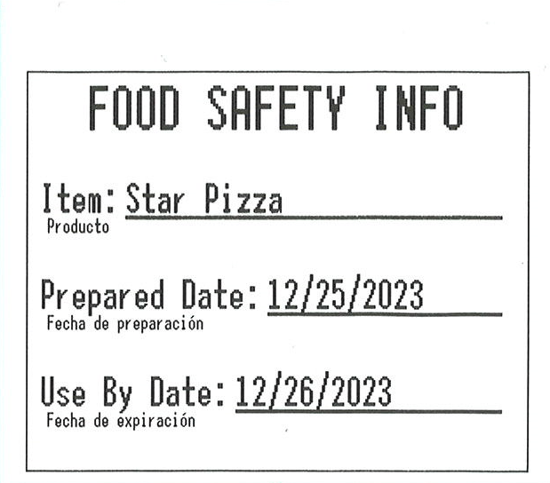 | 72mm |
| 32 | Sale 50% Off |  | 72mm |
| 33 | Visitor Label | 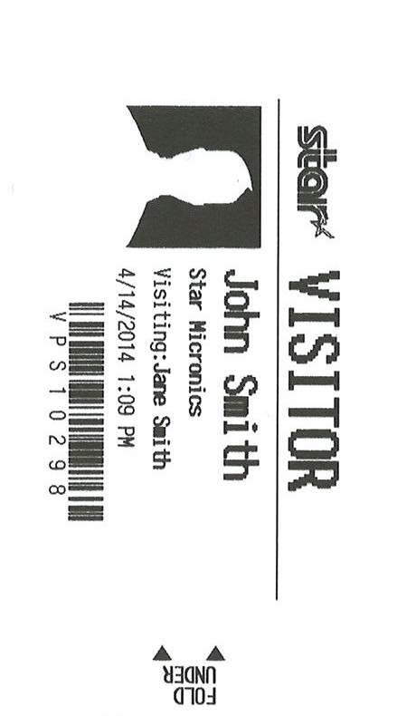 | 48mm |
| 34 | Product Label |  | 48mm |
| 35 | Barbell Label | 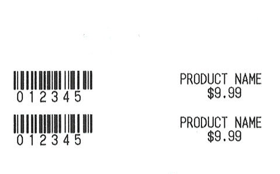 | 55mm |

## Receipt Samples
There are some samples of generating receipts using the template printing function.

Please combine ReceiptSampleXX_SampleName_Template.tsx as template and ReceiptSampleXX_SampleName_FieldData.json as field data.

| \# | Sample Name | Printing Result Image | Printable Area       |
|----|-------------|-----------------------|----------------------|
| 1 | Online Order | 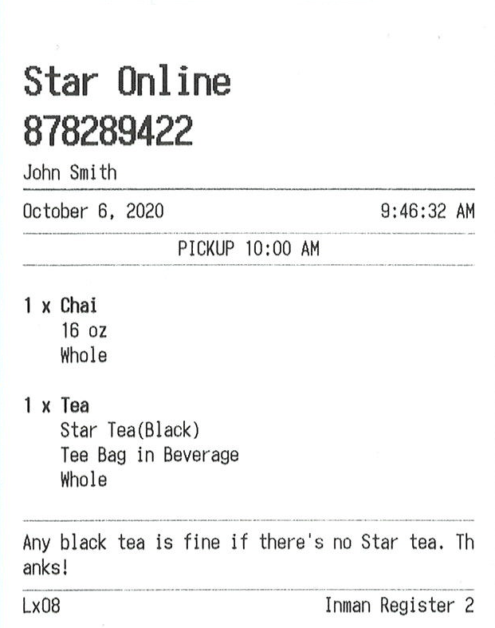 | 72mm |
| 2 | Retail | 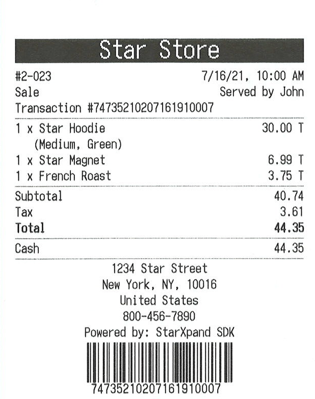 | 72mm |
| 3 | Food Delivery1 |  | 72mm |
| 4 | Food Delivery2 | 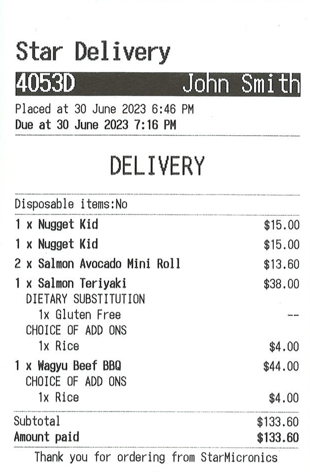 | 72mm |
| 5 | Pharmacy Store1 | 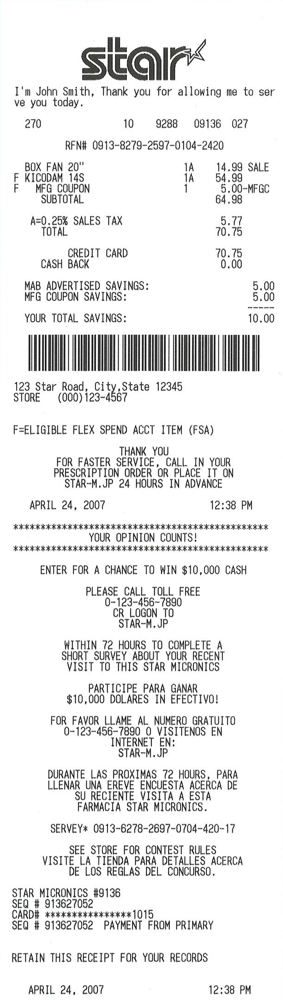 | 72mm |
| 6 | Pharmacy Store2 | 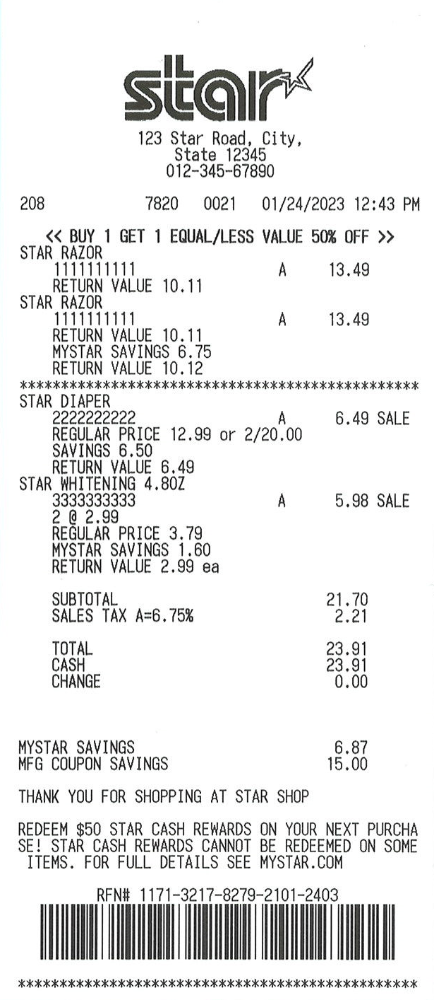 | 72mm |
| 7 | Lunch1 Template | 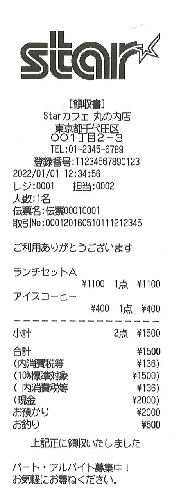 | 48mm |
| 8 | Lunch2 Template | 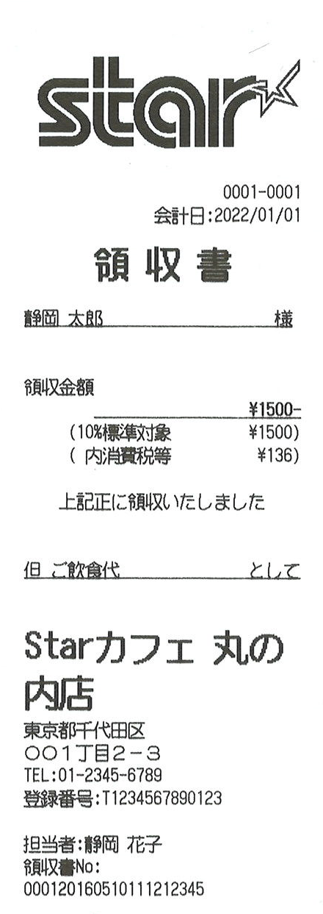 | 48mm |
| 9 | Order1 | 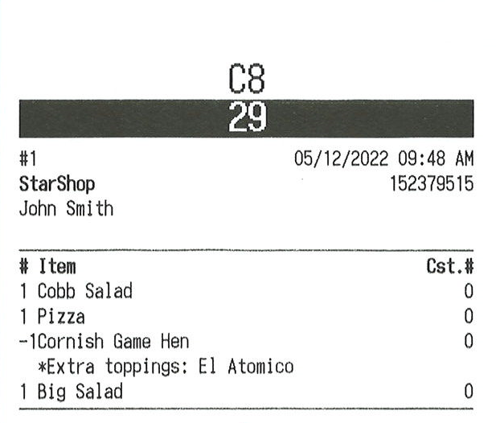 | 72mm |
| 10 | Order2 | 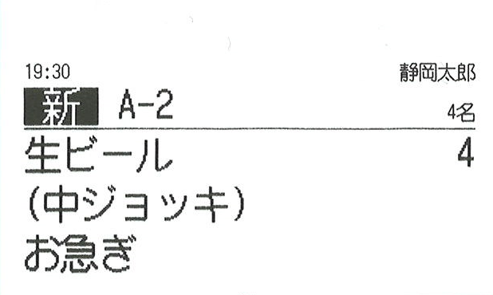 | 72mm |
| 11 | Cafe | 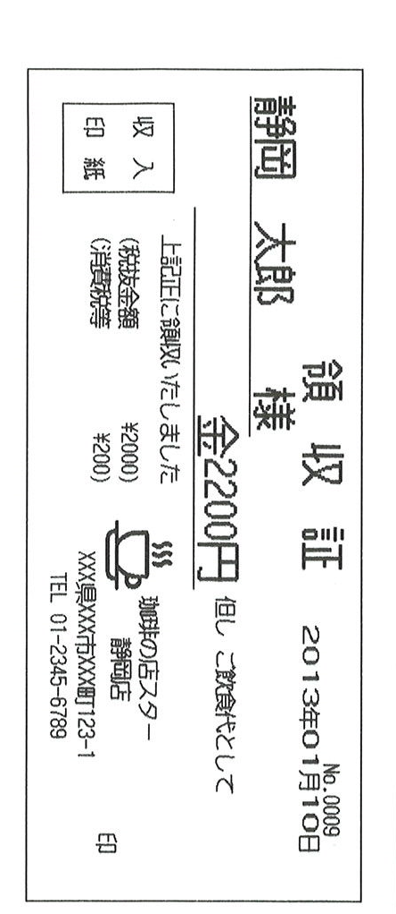 | 48mm |
| 12 | Lottery | 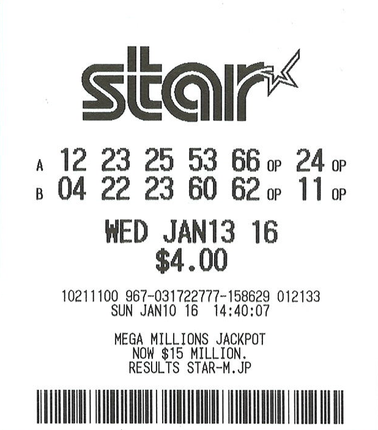 | 72mm |

## Graphic Samples

This is a sample generating receipt image from text data.

| \# | Sample Name | Printing Result Image | Printable Area       |
|----|-------------|-----------------------|----------------------|
| 1 | Graphic Receipt |  | 48mm |
