# Printing Samples
Samples are available to create print layouts for each type of business. Please select a sample that closely resembles the layout you would like to print in your application and edit the sample code to make use of it.

- [Label Samples](#label-samples)
  - [Samples for 203dpi and 300dpi dual-use](#samples-for-203dpi-and-300dpi-dual-use)
  - [Samples for 203dpi](#samples-for-203dpi)
  - [Samples for 300dpi](#samples-for-300dpi)
- [Receipt Samples](#receipt-samples)
- [Graphic Samples for iOS/Android](#graphic-samples-for-iosandroid)

> :warning: Some printer models may not be able to print some samples. Please confirm the APIs available for that model and adjust the layout accordingly when using this samples.

## Label Samples
There are some samples of generating labels using the template printing function.

Please combine LabelSampleXX_ForYYYdpi_SampleName_Template.tsx as template and LabelSampleXX_ForYYYdpi_SampleName_FieldData.json as field data.

### Samples for 203dpi and 300dpi dual-use
For samples \#1 - \#2 and \#8 - \#18, we also provide source code that does not use the template printing function.

| \# | Sample Name | Printing Result Image | Printable Area       |
|----|-------------|-----------------------|----------------------|
| 1 | Tamper Proof Label [Template](LabelSamples/For203dpiAnd300dpi/LabelSample01_For203dpiAnd300dpi_TamperProofLabel_Template.tsx) / [Field Data](LabelSamples/For203dpiAnd300dpi/LabelSample01_For203dpiAnd300dpi_TamperProofLabel_FieldData.json) |  | 72mm(203dpi) / 48.7mm(300dpi)[1](#note1) |
| 2 | Drink Label1 [Template](LabelSamples/For203dpiAnd300dpi/LabelSample02_For203dpiAnd300dpi_DrinkLabel1_Template.tsx) / [Field Data](LabelSamples/For203dpiAnd300dpi/LabelSample02_For203dpiAnd300dpi_DrinkLabel1_FieldData.json)  | 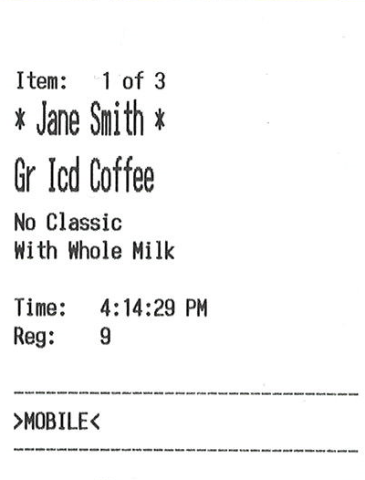 | 48mm(203dpi) / 48.7mm(300dpi)[1](#note1) |
| 3 | Drink Label2 [Template](LabelSamples/For203dpiAnd300dpi/LabelSample03_For203dpiAnd300dpi_DrinkLabel2_Template.tsx) / [Field Data](LabelSamples/For203dpiAnd300dpi/LabelSample03_For203dpiAnd300dpi_DrinkLabel2_FieldData.json)  | 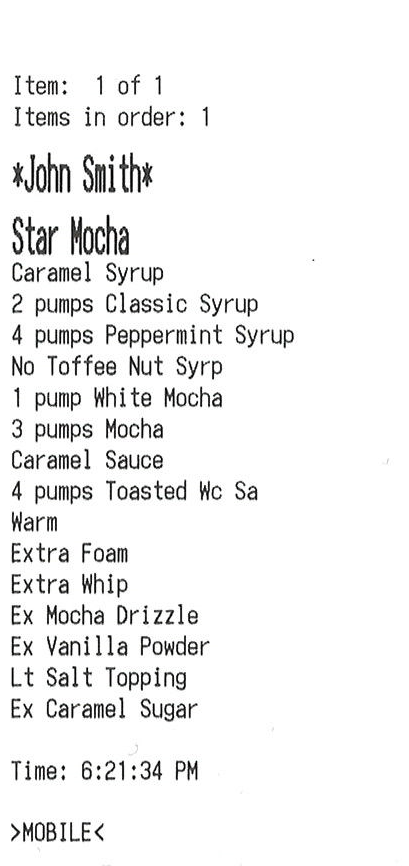 | 48mm(203dpi) / 48.7mm(300dpi)[1](#note1) |
| 4 | Drink Label3 [Template](LabelSamples/For203dpiAnd300dpi/LabelSample04_For203dpiAnd300dpi_DrinkLabel3_Template.tsx) / [Field Data](LabelSamples/For203dpiAnd300dpi/LabelSample04_For203dpiAnd300dpi_DrinkLabel3_FieldData.json) |  | 72mm(203dpi) / 48.7mm(300dpi)[1](#note1) |
| 5 | Drink Label4 [Template](LabelSamples/For203dpiAnd300dpi/LabelSample06_For203dpiAnd300dpi_DrinkLabel5_Template.tsx) / [Field Data](LabelSamples/For203dpiAnd300dpi/LabelSample05_For203dpiAnd300dpi_DrinkLabel4_FieldData.json) | 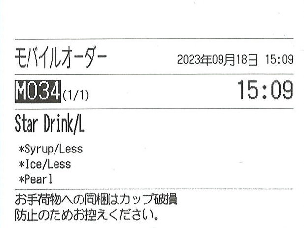 | 72mm(203dpi) / 48.7mm(300dpi)[1](#note1) |
| 6 | Drink Label5 [Template](LabelSamples/For203dpiAnd300dpi/LabelSample06_For203dpiAnd300dpi_DrinkLabel5_Template.tsx) / [Field Data](LabelSamples/For203dpiAnd300dpi/LabelSample06_For203dpiAnd300dpi_DrinkLabel5_FieldData.json) | 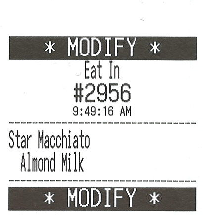 | 48mm(203dpi) / 48.7mm(300dpi)[1](#note1) |
| 7 | Drink Label6 [Template](LabelSamples/For203dpiAnd300dpi/LabelSample07_For203dpiAnd300dpi_DrinkLabel6_Template.tsx) / [Field Data](LabelSamples/For203dpiAnd300dpi/LabelSample07_For203dpiAnd300dpi_DrinkLabel6_FieldData.json) |  | 48mm(203dpi) / 48.7mm(300dpi)[1](#note1) |
| 8 | Nutrition Facts Label [Template](LabelSamples/For203dpiAnd300dpi/LabelSample08_For203dpiAnd300dpi_NutritionFactsLabel.tsx) / [Field Data](LabelSamples/For203dpiAnd300dpi/LabelSample08_For203dpiAnd300dpi_NutritionFactsLabel_FieldData.json) | 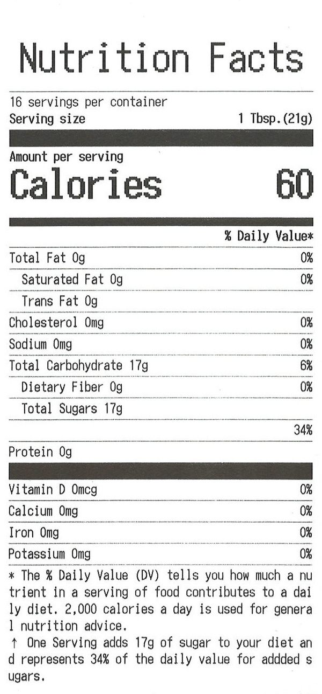 | 72mm(203dpi) / 48.7mm(300dpi)[1](#note1) |
| 9 | Food Prep Label [Template](LabelSamples/For203dpiAnd300dpi/LabelSample09_For203dpiAnd300dpi_FoodPrepLabel.tsx) / [Field Data](LabelSamples/For203dpiAnd300dpi/LabelSample09_For203dpiAnd300dpi_FoodPrepLabel_FieldData.json) |  | 48mm(203dpi) / 48.7mm(300dpi)[1](#note1) |
| 10 | Food Delivery [Template](LabelSamples/For203dpiAnd300dpi/LabelSample10_For203dpiAnd300dpi_FoodDeliveryLabel_Template.tsx) / [Field Data](LabelSamples/For203dpiAnd300dpi/LabelSample10_For203dpiAnd300dpi_FoodDeliveryLabel_FieldData.json) |  | 72mm(203dpi) / 48.7mm(300dpi)[1](#note1) |
| 11 | Shipping Address Label [Template](LabelSamples/For203dpiAnd300dpi/LabelSample11_For203dpiAnd300dpi_ShippingAddressLabel_Template.tsx) / [Field Data](LabelSamples/For203dpiAnd300dpi/LabelSample11_For203dpiAnd300dpi_ShippingAddressLabel_FieldData.json) |  | 72mm(203dpi) / 48.7mm(300dpi)[1](#note1) |
| 12 | Inventory Label [Template](LabelSamples/For203dpiAnd300dpi/LabelSample12_For203dpiAnd300dpi_InventoryLabel_Template.tsx) / [Field Data](LabelSamples/For203dpiAnd300dpi/LabelSample12_For203dpiAnd300dpi_InventoryLabel_FieldData.json) |  | 72mm(203dpi) / 48.7mm(300dpi)[1](#note1) |
| 13 | Food Product Label [Template](LabelSamples/For203dpiAnd300dpi/LabelSample13_For203dpiAnd300dpi_FoodProductLabel_Template.tsx) / [Field Data](LabelSamples/For203dpiAnd300dpi/LabelSample13_For203dpiAnd300dpi_FoodProductLabel_FieldData.json) | 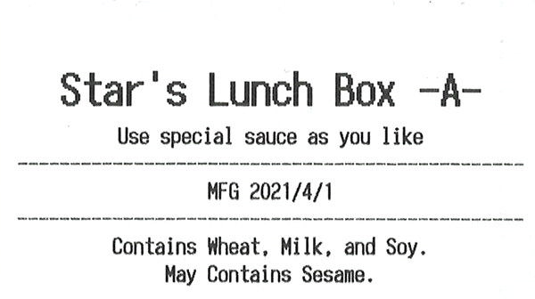 | 72mm(203dpi) / 48.7mm(300dpi)[1](#note1) |
| 14 | Expiration Label(JP) [Template](LabelSamples/For203dpiAnd300dpi/LabelSample14_For203dpiAnd300dpi_ExpirationLabelJP_Template.tsx) / [Field Data](LabelSamples/For203dpiAnd300dpi/LabelSample14_For203dpiAnd300dpi_ExpirationLabelJP_FieldData.json) |  | 48mm(203dpi) / 34mm(300dpi)[1](#note1) |
| 15 | Food Delivery Label(Thai) [Template](LabelSamples/For203dpiAnd300dpi/LabelSample15_For203dpiAnd300dpi_FoodDeliveryLabelThai_Template.tsx) / [Field Data](LabelSamples/For203dpiAnd300dpi/LabelSample15_For203dpiAnd300dpi_FoodDeliveryLabelThai_FieldData.json) | 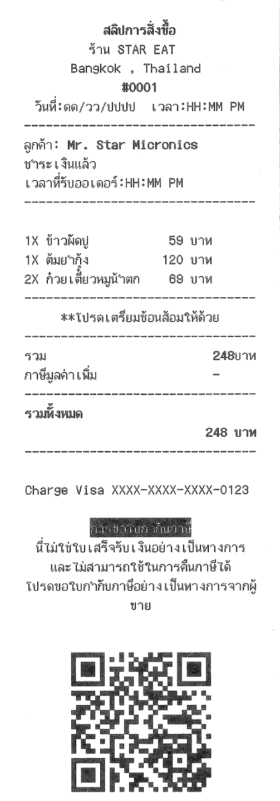 | 48mm(203dpi) / 48.7mm(300dpi)[1](#note1) |
| 16 | Shelf Label for Inventory [Template](LabelSamples/For203dpiAnd300dpi/LabelSample16_For203dpiAnd300dpi_ShelfLabelForInventory_Template.tsx) / [Field Data](LabelSamples/For203dpiAnd300dpi/LabelSample16_For203dpiAnd300dpi_ShelfLabelForInventory_FieldData.json) | 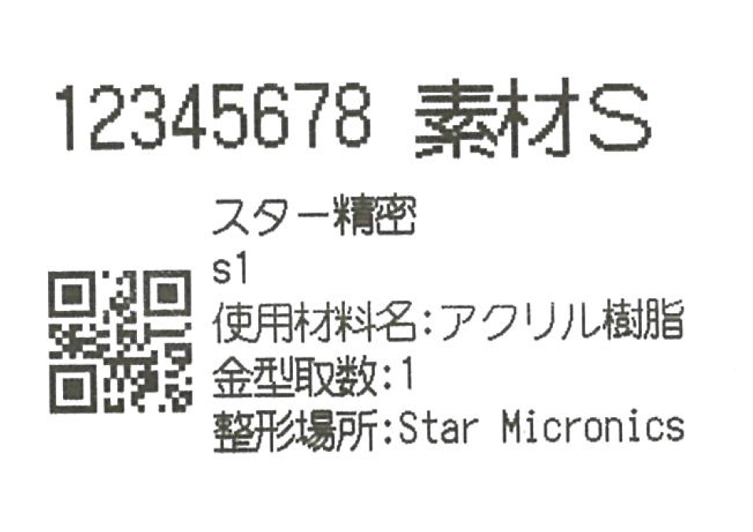 | 48mm(203dpi/300dpi) |
| 17 | Pharmacy Medication2 [Template](LabelSamples/For203dpiAnd300dpi/LabelSample17_For203dpiAnd300dpi_PharmacyMedication2_Template.tsx) / [Field Data](LabelSamples/For203dpiAnd300dpi/LabelSample17_For203dpiAnd300dpi_PharmacyMedication2_FieldData.json) | 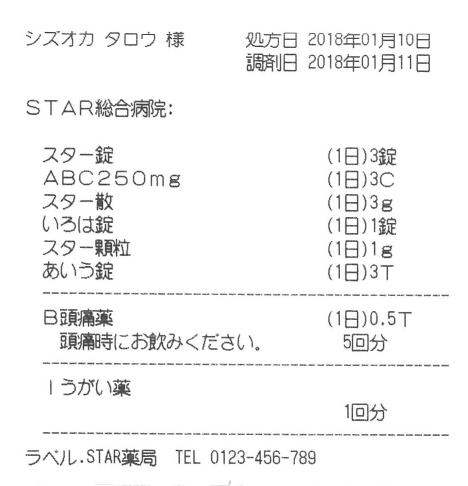 | 72mm(203dpi) / 48.7mm(300dpi)[1](#note1) |
| 18 | Barcode Label2 [Wide Template](LabelSamples/For203dpiAnd300dpi/LabelSample18_For203dpiAnd300dpi_BarcodeLabel2_Wide_Template.tsx) / [Narrow Template](LabelSamples/For203dpiAnd300dpi/LabelSample18_For203dpiAnd300dpi_BarcodeLabel2_Narrow_Template.tsx) / [Field Data](LabelSamples/For203dpiAnd300dpi/LabelSample18_For203dpiAnd300dpi_BarcodeLabel2_FieldData.json) |  | Wide: 72mm(203dpi) / 48.7mm(300dpi)[1](#note1) Narrow: 48mm(203dpi) / 34mm(300dpi)[1](#note1)  |
| 19 | Prescription Label [Template](LabelSamples/For203dpiAnd300dpi/LabelSample19_For203dpiAnd300dpi_PrescriptionLabel_Template.tsx) / [Field Data](LabelSamples/For203dpiAnd300dpi/LabelSample19_For203dpiAnd300dpi_PrescriptionLabel_FieldData.json) | 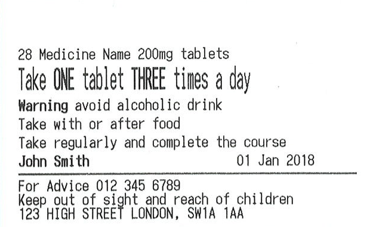 | 72mm(203dpi) / 48.7mm(300dpi)[1](#note1) |
| 20 | Visitor Label [Template](LabelSamples/For203dpiAnd300dpi/LabelSample20_For203dpiAnd300dpi_VisitorLabel_Template.tsx) / [Field Data](LabelSamples/For203dpiAnd300dpi/LabelSample20_For203dpiAnd300dpi_VisitorLabel_FieldData.json) |  | 48mm(203dpi/300dpi) |
| 21 | Product Label [Template](LabelSamples/For203dpiAnd300dpi/LabelSample21_For203dpiAnd300dpi_ProductLabel_Template.tsx) / [Field Data](LabelSamples/For203dpiAnd300dpi/LabelSample21_For203dpiAnd300dpi_ProductLabel_FieldData.json) |  | 48mm(203dpi/300dpi) |

*1: Follow the comments in the template to set the printable area for 300dpi.

### Samples for 203dpi
By adjusting the print position and border size etc., it can be diverted to 300dpi printers.

For samples #1 and #2, we also provide source code that does not use the template printing function.

| \# | Sample Name | Printing Result Image | Printable Area       |
|----|-------------|-----------------------|----------------------|
| 1 | Japanese Food Label(Lunch Box) [Template](LabelSamples/For203dpi/LabelSample01_For203dpi_JapaneseFoodLabelLunchBox_Template.tsx) / [Field Data](LabelSamples/For203dpi/LabelSample01_For203dpi_JapaneseFoodLabelLunchBox_FieldData.json) | 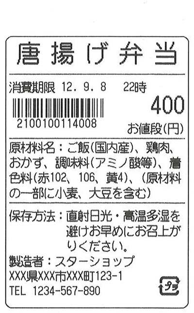 | 48mm |
| 2 | Japanese Food Label(Cake) [Template](LabelSamples/For203dpi/LabelSample02_For203dpi_JapaneseFoodLabelCake_Template.tsx) / [Field Data](LabelSamples/For203dpi/LabelSample02_For203dpi_JapaneseFoodLabelCake_FieldData.json) | 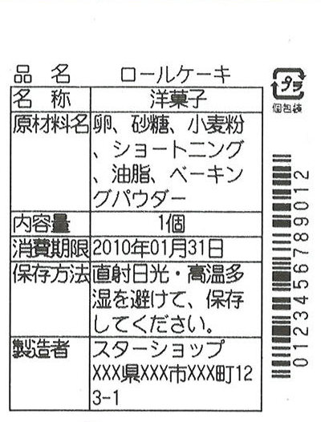 | 48mm |
| 3 | Pharmacy Medication1 [Template](LabelSamples/For203dpi/LabelSample03_For203dpi_PharmacyMedication1_Template.tsx) / [Field Data](LabelSamples/For203dpi/LabelSample03_For203dpi_PharmacyMedication1_FieldData.json) | 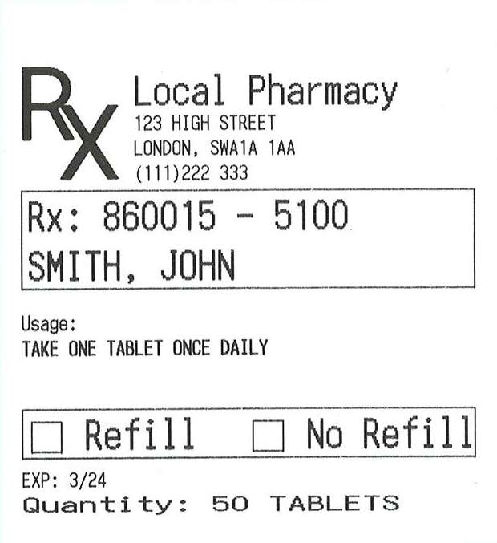 | 72mm |
| 4 | Shipping Label1 [Template](LabelSamples/For203dpi/LabelSample04_For203dpi_ShippingLabel1_Template.tsx) / [Field Data](LabelSamples/For203dpi/LabelSample04_For203dpi_ShippingLabel1_FieldData.json) |  | 72mm |
| 5 | Shipping Label2 [Template](LabelSamples/For203dpi/LabelSample05_For203dpi_ShippingLabel2_Template.tsx) / [Field Data](LabelSamples/For203dpi/LabelSample05_For203dpi_ShippingLabel2_FieldData.json) |  | 72mm |
| 6 | Barcode Label1 [Template](LabelSamples/For203dpi/LabelSample06_For203dpi_BarcodeLabel1_Template.tsx) / [Field Data](LabelSamples/For203dpi/LabelSample06_For203dpi_BarcodeLabel1_FieldData.json) | 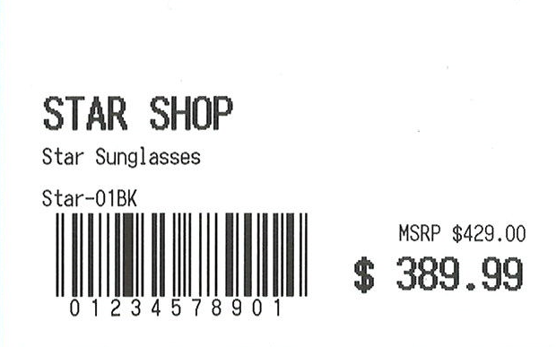 | 72mm |
| 7 | Order Label [Template](LabelSamples/For203dpi/LabelSample07_For203dpi_OrderLabel_Template.tsx) / [Field Data](LabelSamples/For203dpi/LabelSample07_For203dpi_OrderLabel_FieldData.json) |  | 72mm |
| 8 | Allergen Warning [Template](LabelSamples/For203dpi/LabelSample08_For203dpi_AllergenWarning_Template.tsx) / [Field Data](LabelSamples/For203dpi/LabelSample08_For203dpi_AllergenWarning_FieldData.json) |  | 72mm |
| 9 | Cleaned And Sanitised [Template](LabelSamples/For203dpi/LabelSample09_For203dpi_CleanedAndSanitised_Template.tsx) / [Field Data](LabelSamples/For203dpi/LabelSample09_For203dpi_CleanedAndSanitised_FieldData.json) |  | 72mm |
| 10 | Coffee Order [Template](LabelSamples/For203dpi/LabelSample10_For203dpi_CoffeeOrder_Template.tsx) / [Field Data](LabelSamples/For203dpi/LabelSample10_For203dpi_CoffeeOrder_FieldData.json) | 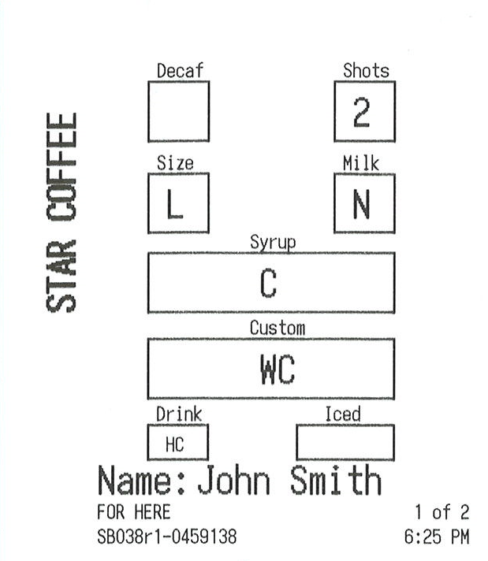 | 72mm |
| 11 | Expiration Date [Template](LabelSamples/For203dpi/LabelSample11_For203dpi_ExpirationDate_Template.tsx) / [Field Data](LabelSamples/For203dpi/LabelSample11_For203dpi_ExpirationDate_FieldData.json) |  | 72mm |
| 12 | FoodSafety Info [Template](LabelSamples/For203dpi/LabelSample12_For203dpi_FoodSafetyInfo_Template.tsx) / [Field Data](LabelSamples/For203dpi/LabelSample12_For203dpi_FoodSafetyInfo_FieldData.json) |  | 72mm |
| 13 | Sale 50% Off [Template](LabelSamples/For203dpi/LabelSample13_For203dpi_Sale50PercentOff_Template.tsx) / [Field Data](LabelSamples/For203dpi/LabelSample13_For203dpi_Sale50PercentOff_FieldData.json) |  | 72mm |
| 14 | Barbell Label [Template](LabelSamples/For203dpi/LabelSample14_For203dpi_BarbellLabel_Template.tsx) / [Field Data](LabelSamples/For203dpi/LabelSample14_For203dpi_BarbellLabel_FieldData.json) | 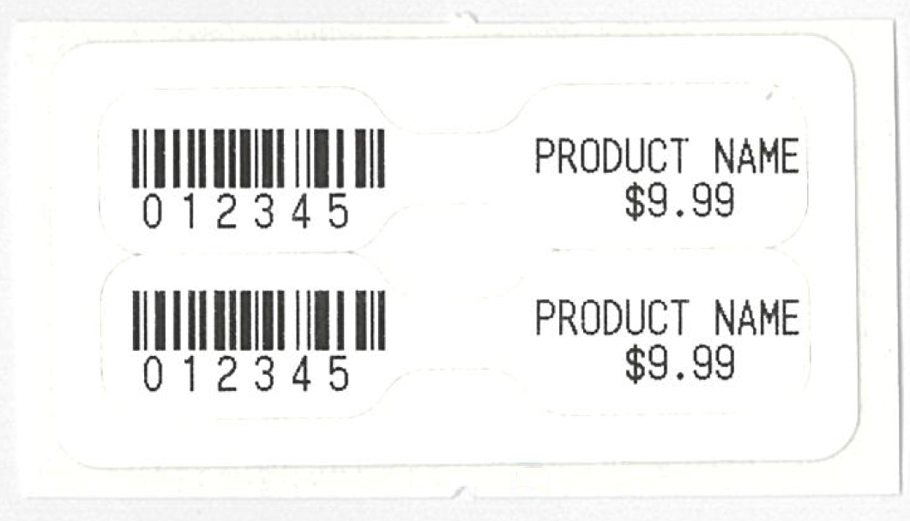 | 54mm |

### Samples for 300dpi
By adjusting the print position and border size etc., it can be diverted to 203dpi printers.

| \# | Sample Name | Printing Result Image | Printable Area       |
|----|-------------|-----------------------|----------------------|
| 1 | Japanese Food Label(Lunch Box) [Template](LabelSamples/For300dpi/LabelSample01_For300dpi_JapaneseFoodLabelLunchBox_Template.tsx) / [Field Data](LabelSamples/For300dpi/LabelSample01_For300dpi_JapaneseFoodLabelLunchBox_FieldData.json) | 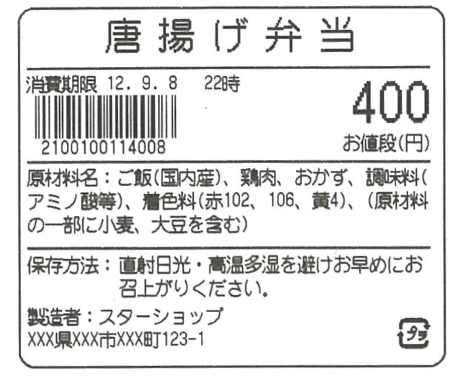 | 48.7mm |
| 2 | Japanese Food Label(Cake) [Template](LabelSamples/For300dpi/LabelSample02_For300dpi_JapaneseFoodLabelCake_Template.tsx) / [Field Data](LabelSamples/For300dpi/LabelSample02_For300dpi_JapaneseFoodLabelCake_FieldData.json) | 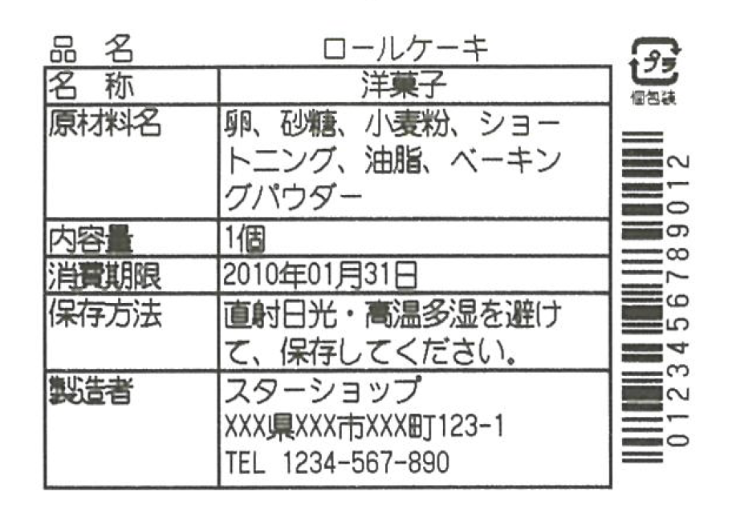 | 48.7mm |
| 3 | Barcode Label1 [Template](LabelSamples/For300dpi/LabelSample03_For300dpi_BarcodeLabel1_Template.tsx) / [Field Data](LabelSamples/For300dpi/LabelSample03_For300dpi_BarcodeLabel1_FieldData.json) | 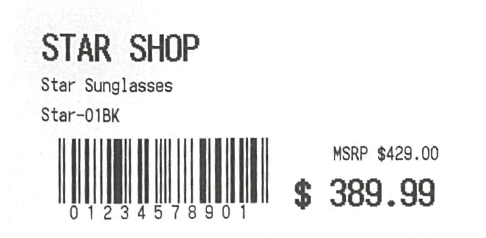 | 48.7mm |
| 4 | Sale 50% Off [Template](LabelSamples/For300dpi/LabelSample04_For300dpi_Sale50PercentOff_Template.tsx) / [Field Data](LabelSamples/For300dpi/LabelSample04_For300dpi_Sale50PercentOff_FieldData.json) | 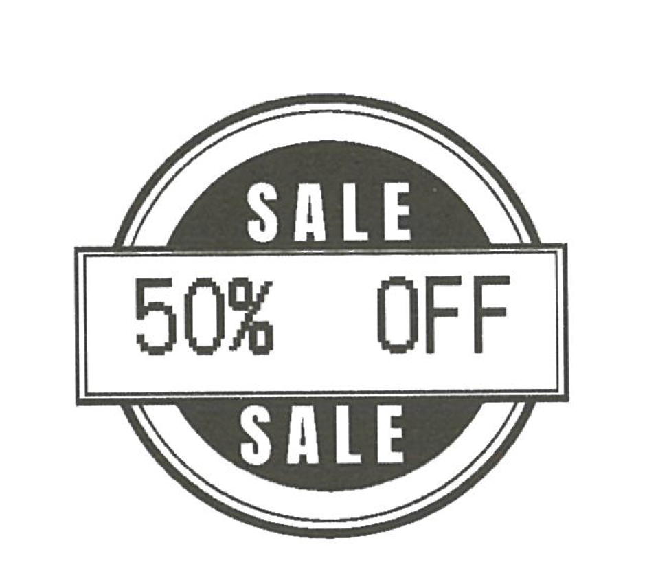 | 48.7mm |
| 5 | Barbell Label [Template](LabelSamples/For300dpi/LabelSample05_For300dpi_BarbellLabel_Template.tsx) / [Field Data](LabelSamples/For300dpi/LabelSample05_For300dpi_BarbellLabel_FieldData.json) | 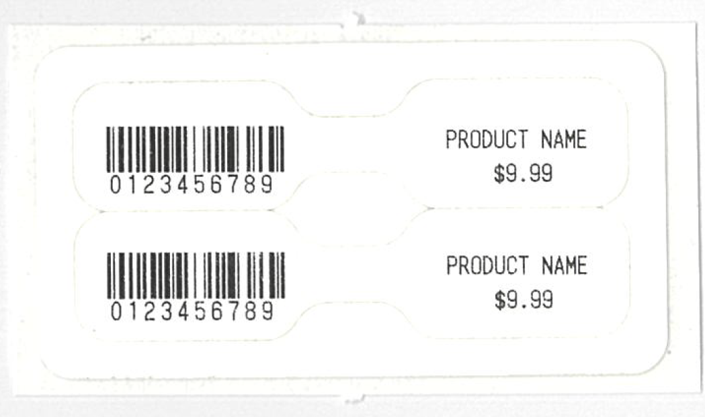 | 54mm |

## Receipt Samples
There are some samples of generating receipts using the template printing function.

Please combine ReceiptSampleXX_SampleName_Template.tsx as template and ReceiptSampleXX_SampleName_FieldData.json as field data.

| \# | Sample Name | Printing Result Image | Printable Area       |
|----|-------------|-----------------------|----------------------|
| 1 | Online Order [Template](ReceiptSamples/ReceiptSample01_OnlineOrder_Template.tsx) / [Field Data](ReceiptSamples/ReceiptSample01_OnlineOrder_FieldData.json) |  | 72mm |
| 2 | Retail [Template](ReceiptSamples/ReceiptSample02_Retail_Template.tsx) / [Field Data](ReceiptSamples/ReceiptSample02_Retail_FieldData.json) |  | 72mm |
| 3 | Food Delivery1 [Template](ReceiptSamples/ReceiptSample03_FoodDelivery1_Template.tsx) / [Field Data](ReceiptSamples/ReceiptSample03_FoodDelivery1_FieldData.json) |  | 72mm |
| 4 | Food Delivery2 [Template](ReceiptSamples/ReceiptSample04_FoodDelivery2_Template.tsx) / [Field Data](ReceiptSamples/ReceiptSample04_FoodDelivery2_FieldData.json) |  | 72mm |
| 5 | Pharmacy Store1 [Template](ReceiptSamples/ReceiptSample05_PharmacyStore1_Template.tsx) / [Field Data](ReceiptSamples/ReceiptSample05_PharmacyStore1_FieldData.json) |  | 72mm |
| 6 | Pharmacy Store2 [Template](ReceiptSamples/ReceiptSample06_PharmacyStore2_Template.tsx) / [Field Data](ReceiptSamples/ReceiptSample06_PharmacyStore2_FieldData.json) |  | 72mm |
| 7 | Lunch1 Template [Template](ReceiptSamples/ReceiptSample07_Lunch1_Template.tsx) / [Field Data](ReceiptSamples/ReceiptSample07_Lunch1_FieldData.json) |  | 48mm |
| 8 | Lunch2 Template [Template](ReceiptSamples/ReceiptSample08_Lunch2_Template.tsx) / [Field Data](ReceiptSamples/ReceiptSample08_Lunch2_FieldData.json) |  | 48mm |
| 9 | Order1 [Template](ReceiptSamples/ReceiptSample09_Order1_Template.tsx) / [Field Data](ReceiptSamples/ReceiptSample09_Order1_FieldData.json) |  | 72mm |
| 10 | Order2 [Template](ReceiptSamples/ReceiptSample10_Order2_Template.tsx) / [Field Data](ReceiptSamples/ReceiptSample10_Order2_FieldData.json) |  | 72mm |
| 11 | Cafe [Template](ReceiptSamples/ReceiptSample11_Cafe_Template.tsx) / [Field Data](ReceiptSamples/ReceiptSample11_Cafe_FieldData.json) |  | 48mm |
| 12 | Lottery [Template](ReceiptSamples/ReceiptSample12_Lottery_Template.tsx) / [Field Data](ReceiptSamples/ReceiptSample12_Lottery_FieldData.json) |  | 72mm |

## Graphic Samples for iOS/Android

This is a sample generating receipt image from text data.

| \# | Sample Name | Printing Result Image | Printable Area       |
|----|-------------|-----------------------|----------------------|
| 1 | Graphic Receipt [Source Code](GraphicSamples/GraphicSample01_GraphicReceipt.tsx) |  | 48mm |
